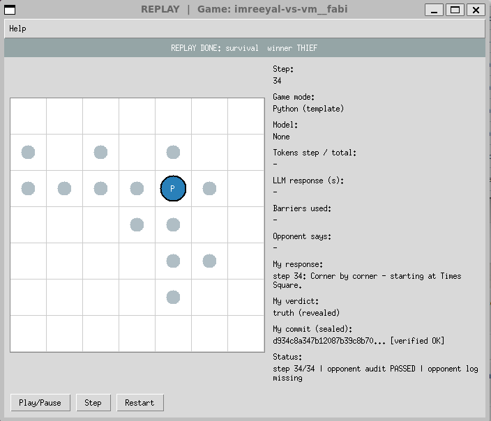
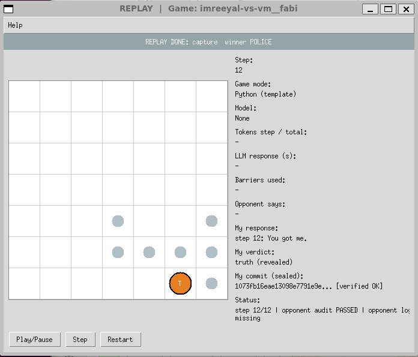

# cop-rob-p2p — Distributed Cop-Thief P2P Agent System (team vm__fabi)

University of Haifa final project (Orchestration of AI Agents). Two autonomous
**FastMCP** peers — **Police** and **Thief** — play a hidden-position pursuit game
over a peer-to-peer network. There is **no central server or referee**: each peer
keeps only its own private truth, seals every move with **commit-reveal**, audits
the opponent's revealed log at game end, and settles on **byte-identical** results
that interoperate with independently-implemented peers from other teams.

- **Code / book / interop versions:** code `1.0.0`, targets book & reference
  **v3.0.0** (© Dr. Yoram Segal), league protocol **v3.0.0**, config schema `1.3`.
- **Team:** `vm__fabi` (`VM-Fabi`). Member IDs: _to be filled before submission_.

## Repositories

- **Workspace (this repo):** canonical core + PR development — `mironovich-v/cop-rob-p2p`
- **Police submission (generated):** `mironovich-v/cop-rob-p2p-police`
- **Thief submission (generated):** `mironovich-v/cop-rob-p2p-thief`

The two submission repos are **generated** from this one canonical core by
`scripts/export_repos.py` — never hand-edited (see [Export](#two-repository-export)).

## Compliance with the book's separation and submission rules

The book (`instructions/police_thief_p2p.pdf`, v3.0.0) states four binding rules
about separation and submission. They are quoted here with what we do about each,
because our topology — one canonical core, two generated submission repos — is a
deliberate choice and should be read as such rather than inferred.

**Rule 1 (binding table, ch. "Network architecture, decentralisation and local
epistemology"; sanction: *total failure*)** — *"MUST run the thief code and the
police code in two completely separate **processes**, under separate
configuration directories."* §2.4.2 (p. 31) gives the reason: the hazard is
**local development**, where one team builds both agents on one machine and risks
accidental overlap; in the league the peers are on different machines regardless.

> We satisfy this literally. `police_agent` and `thief_agent` are launched as two
> independent OS processes, each with its own configuration directory
> (`config/police/` vs `config/thief/`), its own port, its own log directory and
> its own private state. No sub-game is ever played by one process acting as both
> roles. The requirement is about **processes**, and it is met at the process
> level.

**Rule 2 (binding table; sanction: *immediate disqualification for information
leakage*)** — *"FORBIDDEN to share memory or variables between the sides."*
§2.4.2 makes the target explicit: it forbids *"importing a shared module that
holds **live state**"*.

> We satisfy this. The two peers are separate processes, so no object, variable
> or singleton is shared; each keeps its own private truth and learns about its
> opponent only through the wire. The prohibition is on shared **live state**,
> not on shared **code** — and sharing code is what the engineering guideline
> independently *requires* (no duplicated logic, DRY, single canonical source).
> Duplicating the core into two hand-maintained copies would satisfy neither rule
> better and would violate that one.

**Rule 49** — *"MUST **submit** two separate GitHub repositories — police and
thief — with a cross-link in the READMEs, two links in the Moodle submission and
four links in the JSON."* **Rule 50** — each repo contains at minimum README,
`config/`, PRD files, PLAN and TODO.

> We satisfy both. The two submission repos are generated by
> `scripts/export_repos.py`, each self-contained and independently installable and
> testable, each cross-linking its sibling, each carrying the full documentation
> set. They are regenerated and pushed after **every** merge to the canonical
> `main` (workflow step 10), so they never lag the code that plays.

**The one place we differ from the book's phrasing, stated plainly.** Chapter 9.4
(p. 96) describes the expectation as *"each group **develops** two agents — police
and thief — in two separate GitHub repositories."* We **develop** in one canonical
workspace and **generate** the two submitted repos from it.

> We chose this because the alternative — two independently developed codebases —
> means duplicating the domain, interop, protocol, orchestration and audit layers,
> which the engineering guideline forbids outright ("never manually duplicate
> shared modules") and which would make byte-exact interoperability between our
> own two agents a matter of luck. The lecturer's own reference implementation is
> likewise a single mono-repo playing both roles.
>
> The purpose rule 50 states for its mandated contents is *"to let the examiner
> reconstruct the way of working — not just the final result."* That purpose is
> served: branch **`workspace-history`** in *both* submission repos mirrors the
> canonical workspace's complete development history, so the full PR-by-PR record,
> and every commit we ever declared in a match, resolve **inside the submitted
> repositories** without needing the workspace repo. See `results/played_commits.md`
> for the series-to-commit map and `docs/decisions.md` (ADR-10, ADR-23, ADR-24)
> for the decision records.
>
> Note the two branches mean different things: **`main`** is the exported agent
> tree, and **`workspace-history`** is where declared match commits resolve.

## Installation

Requires **Python 3.13** and **[uv](https://docs.astral.sh/uv/)** (the only
supported package manager — no `pip`/`venv`).

```bash
uv sync                       # create the environment from pyproject.toml + uv.lock
uv run ruff check src tests scripts
uv run pytest tests -q        # 225 tests, all offline (no network / no live LLM)
uv run pytest tests --cov=src --cov-fail-under=85
```

Secrets live in a git-ignored `.env` (never committed). Copy the template and fill
locally only if you enable Gmail / a cloud LLM / a public tunnel:

```bash
cp .env-example .env
```

## Usage

### Play a headless game (two peers, two terminals)

Each peer is its own OS process with its own config dir, port, and private state.
Ports are wired in `config/<role>/game.toml` (police `8802` ↔ thief `8801`).

```bash
# terminal 1 — police peer
uv run python -m police_agent --config config/police

# terminal 2 — thief peer
uv run python -m thief_agent  --config config/thief
```

Each peer negotiates terms, plays the series, writes its four JSON artifacts under
`logs/<group_id>/`, and prints the **derived** result. `--real-llm` opts into the
configured banter provider (default: offline stub — the MOVE is always pure Python).

### Live GUI (local truth only)

```bash
uv run python -m cop_thief_core.gui --config config/police --role police
uv run python -m cop_thief_core.gui --config config/thief  --role thief
```

Press **Start** in each window. The board shows only that peer's own position,
barriers, visited trail, and the opponent-location **belief heatmap** — never the
opponent's true position (full truth exists only in replay, after reveal).

### Replay a sealed log (both revealed trajectories, integrity-checked)

```bash
uv run python -m cop_thief_core.gui --config config/police \
    --replay logs/vm__fabi-police/log_<game_id>_g01.json
```

Replay re-verifies each step's commit against its revealed nonce and, when the
sibling log is present, draws both true trajectories on one board.

#### Screenshots

Both captures below are from the **counted series against imreeyal**
(2026-08-23), replayed from the sealed logs archived under
`results/counted/imreeyal-2026-08-23/`.

| Sub-game 5 — we played police, thief survived | Sub-game 2 — we played thief, captured at step 12 |
|---|---|
|  |  |

Each window shows the banner verdict, the step counter, the sealed commit with
its per-step verification (`[verified OK]`), and the audit status. Note
`opponent log missing` in the status line: a peer keeps only **its own** sealed
log, so the both-trajectory overlay appears only once the sibling log has been
gathered — the local-truth boundary holding even in retrospective replay.

The thief capture is the position that drove the strategy rebuild in ADR-25:
the evader is pinned on the bottom edge with the pursuer landing on it, because
the brain of the day could not choose STAY.

### Interoperability vectors (cross-team byte-exactness)

The league kit is owned by another team and is **not vendored**; fetch it, then run
the conformance suite (our production functions reproduce every CORE vector):

```bash
scripts/fetch_interop.sh
uv run pytest tests/conformance -q
```

### Two-repository export

```bash
uv run python scripts/export_repos.py          # -> dist/police-agent, dist/thief-agent
```

Each `dist/<role>-agent` is self-contained (vendored `cop_thief_core` + role entry
point + configs + tests + a `core_manifest.json` recording the source commit/hash);
the exporter refuses to finish if the vendored core differs between the two.

## Architecture

- **No central truth.** Each peer holds only its private position; there is no
  shared board. Public, private, inferred, and audit-only-revealed state are kept
  separate so a live strategy or GUI cannot reach opponent truth.
- **SDK single entry point.** All consumers (role CLIs, GUI, tests) go through
  `SimulationSdk.run_peer` — no business logic in the CLI/GUI layers. One
  role-agnostic core plays both roles; role behaviour is config/injection-driven.
- **Commit-reveal + mutual audit.** Every move is sealed
  `SHA256(canonical_json(payload) + "|" + nonce)`; nonces are revealed at game end
  and re-verified by the opponent. A tampered log forfeits (`tamper_forfeit`).
- **Byte-exact interop.** One canonical serializer (compact, sorted-keys,
  `ensure_ascii=False`) underlies every hash; the report consensus signature uses a
  second, deliberately spaced serializer. All constructions match pinned league
  vectors. See [`docs/INTEROP.md`](docs/INTEROP.md) and `CLAUDE.md` §36.
- **Four JSON artifacts** per series (declaration, per-sub-game config + log,
  aggregate result) sharing one `game_uid`; totals are always derived from the
  sealed log, never declared. The official report is emailed as the **exact hashed
  canonical bytes** (Gmail draft, disabled by default).

```
src/cop_thief_core/   domain · interop · protocol · orchestration · reporting
                      infra (FastMCP + Gmail) · gui · strategy · sdk · shared
src/police_agent/  src/thief_agent/     role entry points (thin, delegate to SDK)
config/<role>/     private game.toml + signed shared game.json + rate_limits.json
scripts/           export_repos.py · fetch_interop.sh
docs/              PRD / PLAN / TODO · per-mechanism PRDs · decisions · architecture
```

## Configuration

All game parameters come from `config/` (never hard-coded), validated against the
official Appendix-F minimums; a different parameter set is a different variant.
Each role has a private `game.toml` (strategy, ports, LLM, email) and a
**byte-identical signed** `game.json` (the Appendix-F constitution), plus
`rate_limits.json` for the API gatekeeper. Every external call (LLM, Gmail,
opponent MCP) is routed through the gatekeeper. Set member IDs, opponent URL, and
email/LLM/tunnel opt-ins per role before a real match.

## Security & privacy

No secrets are committed. LLM/Gmail/tunnel credentials live in `.env` (ignored);
`.env-example` holds placeholders only. Gmail defaults to **disabled/draft** — a
real send needs a deliberate config opt-in. Public MCP endpoints use token auth
over a documented tunnel with a pre-match connectivity probe.

## Contributing / standards

`uv` only; `ruff` clean (line-length 100); TDD with coverage ≥ 85%; every Python
file ≤ 150 code lines. Work proceeds in small, single-purpose PRs following the
strict git workflow and structured commit body in [`CLAUDE.md`](CLAUDE.md); staged
plan in [`docs/PLAN.md`](docs/PLAN.md) / [`docs/TODO.md`](docs/TODO.md).

## License & credits

Independent student implementation for University of Haifa (team `vm__fabi`).
Targets the book / reference **v3.0.0** (© Dr. Yoram Segal / GTAI) and the league
interoperability kit — both **cited, never copied**. See [`docs/INTEROP.md`](docs/INTEROP.md)
and `CLAUDE.md` §36 for the ground-truth spec and attributions.
