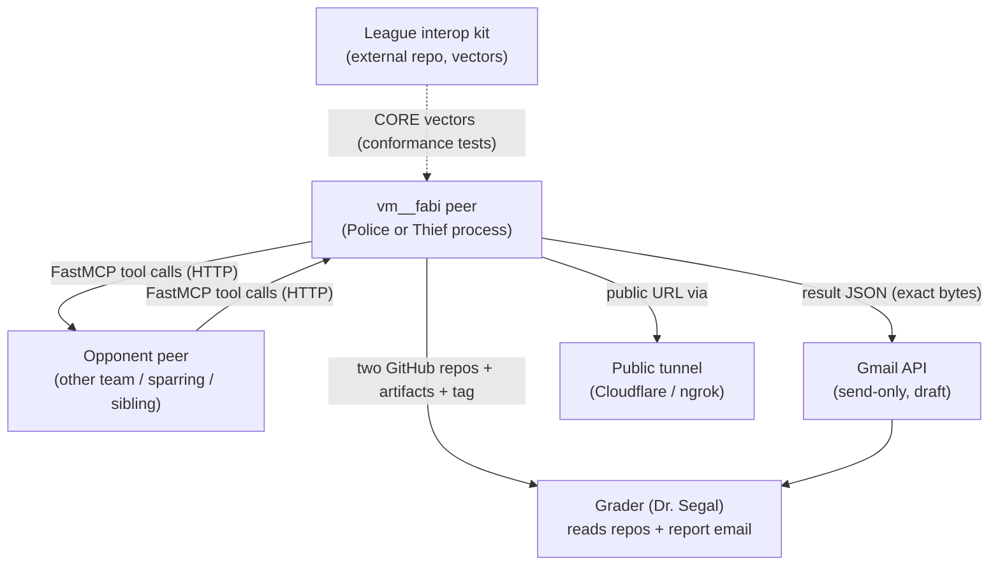
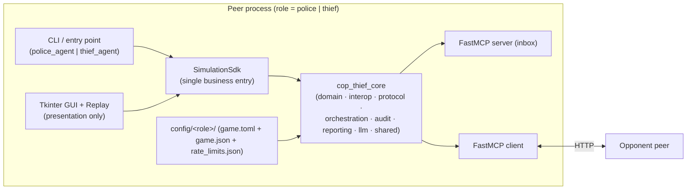

# PLAN — Architecture & Design

> Design document for the vm__fabi Cop-Thief P2P system. Complements
> `docs/PRD.md` (requirements) and `docs/architecture.md` (runtime component &
> data-flow detail). Architectural decisions and resolved book contradictions are
> recorded as ADRs in `docs/decisions.md`. Confirmed constants/constructions are
> in `CLAUDE.md` §36 and not restated here.

## 1. C4 — Context

No central server, referee, or shared state. The only a-priori knowledge a peer
has of its opponent is the opponent's MCP URL.

## 2. C4 — Container

Each peer is one OS process combining a FastMCP **server** (its inbox) and
**client** (calls the opponent), driven by the SDK over the shared core.

## 3. C4 — Component (`cop_thief_core`)

- **domain/** — pure, no I/O: `board`, `own_state`, `rules`, `scoring`, `smell`,
  `belief`, `brains`, `constants`. Exhaustively unit-tested.
- **interop/** — canonical JSON (compact + spaced), `commit_reveal`,
  `negotiation`/terms signature, `game_ids`. Backed by CORE vectors.
- **protocol/** — typed message schemas (`TurnMessage`, `ControlMessage`,
  `AuditPayload`) + validation.
- **orchestration/** — the finite-state machine, turn loop, deadlines, watchdog,
  idempotency, restart.
- **audit/** — log sealing, mutual audit, replay verification.
- **reporting/** — the four JSON artifact builders, report canonicalization +
  consensus signature, Gmail send.
- **llm/** — verbal-hint provider abstraction (offline default).
- **shared/** — `config` (CFG singleton), `gatekeeper` + `rate_limiter`,
  `sysinfo`, `version`.
- **sdk/** — `SimulationSdk` single entry point; series runner.
- `src/police_agent`, `src/thief_agent` — thin role entry points; strategy seam.

## 4. Key data flows

**Turn cycle (per step):** receive `TurnMessage` → validate/route via orchestrator
→ update belief + absorb scent (decay) → note barriers/claims → compute legal
actions → strategy picks move (pure Python) → optional hint (template/LLM) → seal
`(state, move, verdict)` under commit → emit own scent → send `TurnMessage`
(commit only; nonce withheld). Thief moves first; ping-pong turn token.

**Lifecycle:** startup → network readiness → **negotiation** (exchange terms,
mutual signature, derive `game_uid`/`game_id`) → per-sub-game turns → capture/win
claims → **mutual audit** (exchange revealed logs+nonces, re-verify) → result
consensus → artifacts + report/email → completion (role alternation across the
series; failed audit → `tamper_forfeit`).

## 5. Trust boundaries (see architecture.md §Trust)

Own private truth (position, strategy state, nonces) never crosses the wire in
the clear; only commits, public barriers, capture claims, scent maps, and hints
do. Opponent position is *inferred* only. Live GUI shows local truth only; full
truth appears only in retrospective replay after audit material is revealed.

## 6. Interfaces & contracts

- **SDK:** `SimulationSdk.run_peer(role, …) -> dict` (single business entry;
  GUI/CLI delegate only).
- **MCP tools (4):** `negotiate`, `receive_turn`, `submit_audit`,
  `receive_control` → `{"ok": true}`; typed request schemas; reject
  unknown/malformed/stale/duplicate/out-of-order.
- **Message schemas:** `protocol/` dataclasses with `to_dict`/`from_dict`.
- **Artifact schemas:** four JSON files sharing one `game_uid` (see
  `PRD_logging_audit_reporting`).
- **Interop byte contracts:** the six CORE surfaces, pinned in `CLAUDE.md` §36.3
  and verified by `tests/conformance/`.
- **Config contract:** signed `game.json` (14-key terms subset) + private
  `game.toml`; loaded via `CFG`; validated against Appendix-F minimums.

## 7. Deployment

- **Local:** two processes on `127.0.0.1` (thief 8801, police 8802), separate
  private config dirs; start order irrelevant (retry until peer is up).
- **Public:** each peer behind a documented tunnel with Host-header rewrite (SPEC
  App. D); a pre-match connectivity probe makes a harmless tool call first.
- **Submission:** `scripts/export_repos.py` generates `dist/police-agent` and
  `dist/thief-agent` (self-contained, vendored core snapshot, cross-linked, drift
  check).

## 8. Phase Plan

Each phase runs **end-to-end before the next** (strict linear progression). The
per-slice PR breakdown, LOC budgets, and completion checkboxes live in
`docs/TODO.md`; mechanism PRDs are indexed in `docs/PRD.md` and authored at the
head of their phase.

| Phase | Objective | Entry | Exit criteria | PRDs |
|-------|-----------|-------|---------------|------|
| **-1 Planning** | Control files + full doc set | repo exists | Stage -1 docs merged | (planning docs) |
| **1 Base Logic** | Deterministic domain + config | -1 done | domain (board/own-state/rules/scoring) + `CFG` tested; a scripted game advances by rules | game_state, scoring_league, config_constitution |
| **2 MCP Infra + orchestration** | Two peers negotiate & play over transport | 1 done | agreement + a full sub-game over fake/real MCP; results & audit agree | mcp_protocol, gatekeeper_rate_limit, pregame_agreement, orchestrator_fsm, player_agents |
| **3 Strategy & belief** | Legal-action strategy + belief map | 2 done | strategy always returns a legal action; pluggable brain seam works | belief_map, strategy_brains |
| **4 Language + Scent** | Scent + verbal hints wired in | 3 done | scent emit/decay matches CORE vector; hints capped & audited | pheromone_scent, llm_verbal_layer |
| **5 Cloud + Tunnel** | Public reachability | 4 done | peer reachable via a documented tunnel; pre-match probe passes | cloud_tunnel |
| **6 Security** | Commit-reveal + interop finalize | 5 done | sealed logs, mutual audit, tamper→forfeit; **all CORE vectors pass from our code** | commit_reveal, interop_serialization |
| **7 Reporting Shell** | Artifacts, Gmail, GUI, replay, export | 6 done | four artifacts + report + Gmail draft + GUI + replay + two-repo export | logging_audit_reporting, email_reporting, gui_replay, two_repo_export |

**RTS (Ready-To-Submit)** is declared only when **all** PRD acceptance criteria
(`docs/PRD.md` §4, AC1–AC17) are satisfied — completing Phase 7 is necessary but
not sufficient (interop, submission, and quality ACs also gate RTS).

## 9. Architectural decisions

Recorded as ADRs in `docs/decisions.md` (ADR-1..N), including the five resolved
book contradictions. Notable: SDK-first + role-agnostic single core; interop =
reference form; league kit external (not vendored); Python 3.13; two-repo export
from one canonical core.
